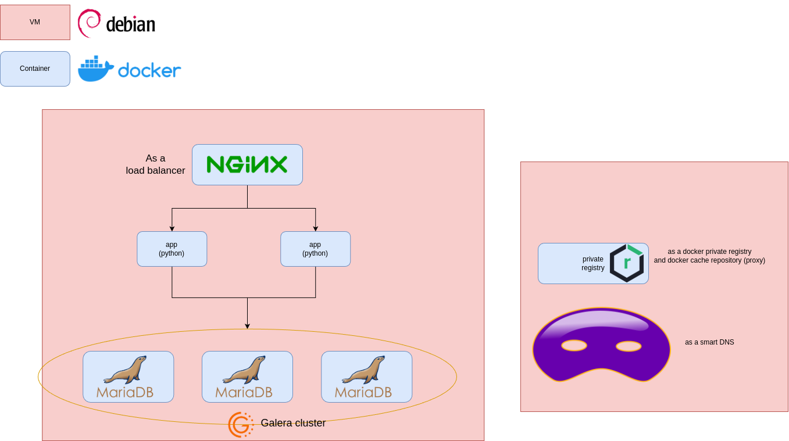

# runc DevOps engineering entry challenge
## Overview
 Wellcome to my projject The goal of this task is to design and implement a DevOps infrastructure for a Django application, focusing on classic tools such as Docker, Gitlab, and...

### The main parts of the challenge:
#### 1. Create a private Docker registry
  - Must be run via Docker Compose
  - Using shekan or smart DNS to get the images

[registry](registry) documentation
#### 2. Server preparation and hardening
  - Disable root login
  - Activating the firewall

[Server pripairing](#prepairing)
#### 3. Implementing CI/CD using Gitlab
  - Build a Docker image for a Django application
  - Pushing an image to a private registry
  - Deploying the application to the server

[app and CI/CD](app) documentation
#### 4. Deploying Django applications and services
  - Django application in two separate containers
  - MariaDB database with high availability configuration
  - Nginx service for load balancing between Django containers

Due to limited resources, we create two very small Debian12 VMs on the personal system 
- One for main services (**VM-1**)
- Another as a registry server (**VM-2**)

### TLD of project:

# prepairing
