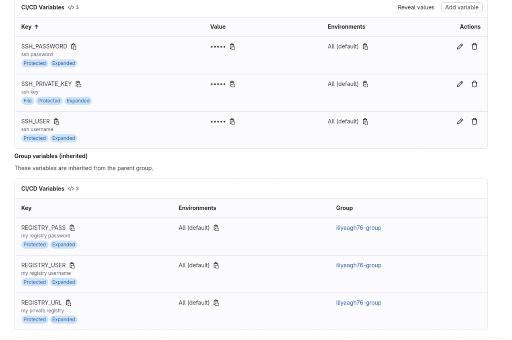
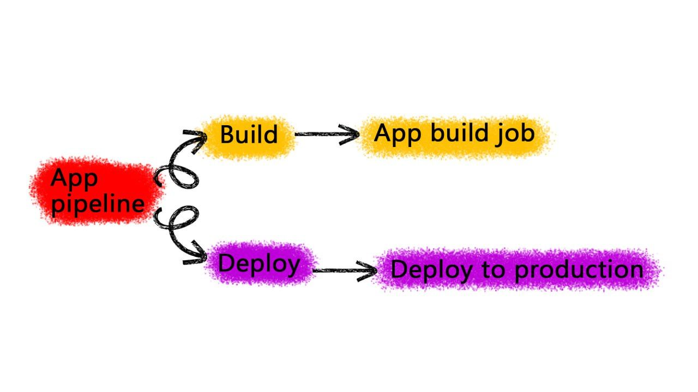
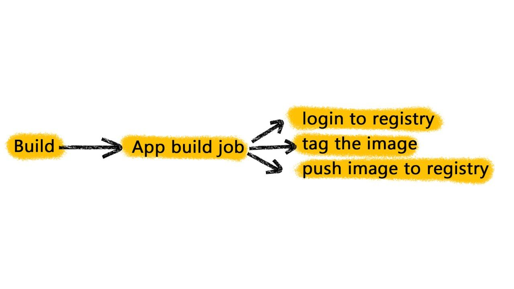
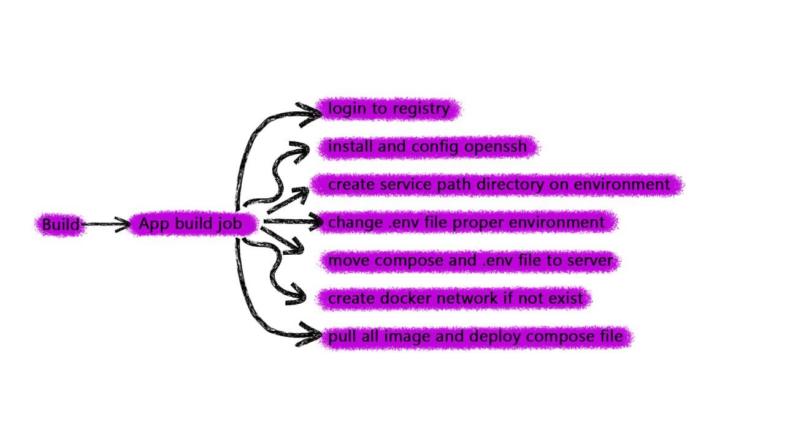
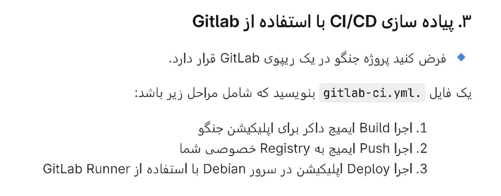
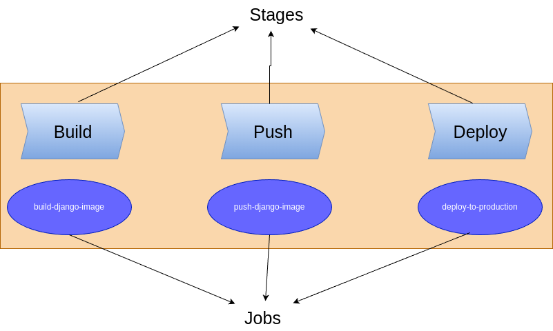
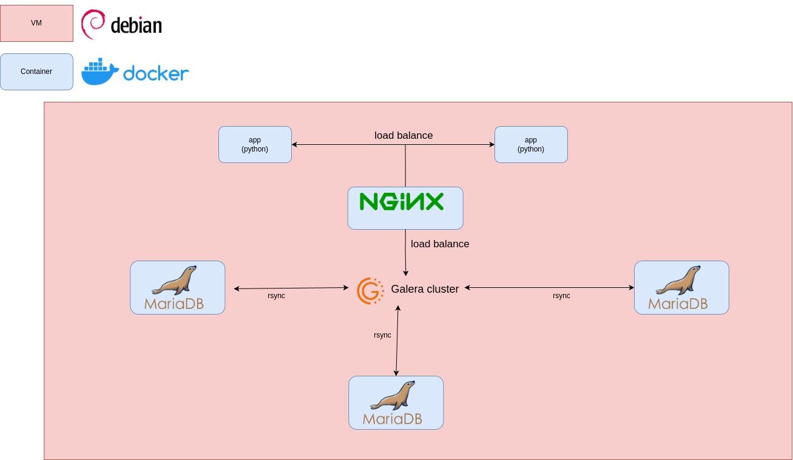
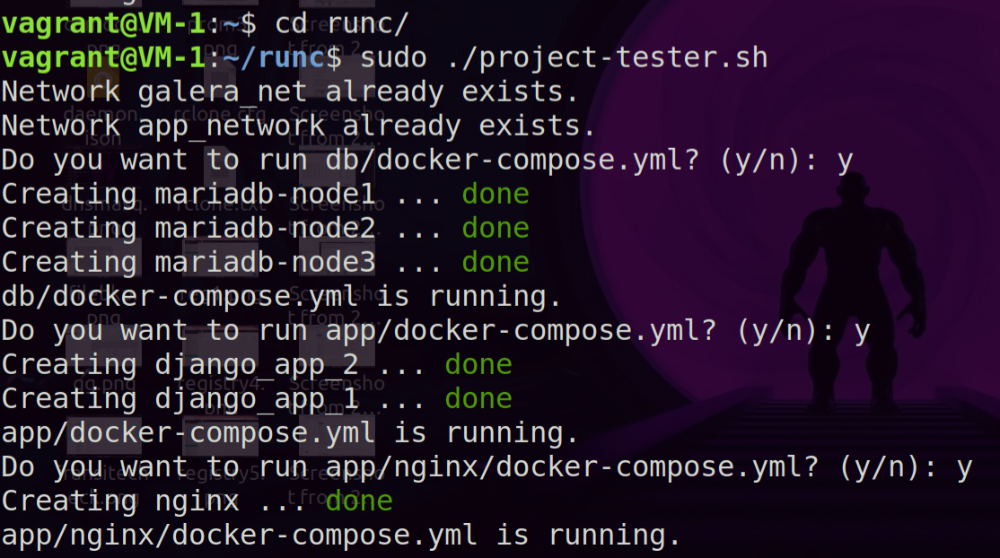

# App and CI/CD readme

## Project Structure:
First we create a sample project structure
```bash
.
├── django
│   ├── db.sqlite3
│   ├── Dockerfile
│   ├── .dockerignore
│   ├── manage.py
│   ├── myproject
│   │   ├── asgi.py
│   │   ├── __init__.py
│   │   ├── __pycache__
│   │   │   ├── __init__.cpython-39.pyc
│   │   │   ├── settings.cpython-39.pyc
│   │   │   └── urls.cpython-39.pyc
│   │   ├── settings.py
│   │   ├── urls.py
│   │   └── wsgi.py
│   └── requirements.txt
├── docker-compose.yml
├── .env
├── .gitlab-ci.yml
├── nginx
│   ├── conf.d
│   │   ├── app_proxy.conf
│   │   └── db_proxy.conf
│   ├── docker-compose.yml
│   ├── .env
│   └── nginx.conf
└── README.md
```
# CI/CD pipeline:
## Protected variables:
set protected variable in Project ⇒ Settings ⇒ CI/CD ⇒ Variables

```bash
#CI/CD Variables
SSH_USER
SSH_PASSWORD
SSH_PRIVATE_KEY

# Group variables (inherited)
REGISTRY_PASS
REGISTRY_USER
REGISTRY_URL
```


In this task, we are asked to do two stages:
```bash
stages:
  - Build
  - Deploy
```
Given that there are only two stages(Which we call production) and one environment in this task, we design the pipeline as follows:
**pipeline:**

**build job**

**deploy job**


- I used dind for the GitLab Runner executor
- Manual approval is required for deployment.

In the **gitlab-ci.yml** file I used two stages which makes more sense, But according to the task file you see below, we need to use three stages



The pipeline design looks something like this:



I didn't change the main file inside the project, but I'll put the three-stage pipeline structure here.

```yaml
stages:
  - build
  - push
  - deploy

default:
  before_script:
    - docker login -u ${REGISTRY_USER} -p ${REGISTRY_PASS} ${REGISTRY_URL}


variables:
  SSH_PORT: 22
  IMAGE_BASE_PATH: ${REGISTRY_URL}/task
  IMAGE_NAME: app
  SERVICE_PATH: /opt/services/app
  IMAGE_TAG_SHA: ${CI_COMMIT_SHORT_SHA}
  APP_VERSION: ${CI_COMMIT_TAG:-${CI_COMMIT_SHORT_SHA}}
  APP_NETWORK: app_network

build-django-image:
  stage: build
  script:
    - cd django
    - docker build -t ${IMAGE_BASE_PATH}/${IMAGE_NAME}:${IMAGE_TAG_SHA} .
    - docker save ${IMAGE_BASE_PATH}/${IMAGE_NAME}:${IMAGE_TAG_SHA} -o app_image.tar
  artifacts:
    paths:
      - django/app_image.tar
    expire_in: 1 hour
  retry: 2

push-django-image:
  stage: push
  needs:
    - build-django-image
  script:
    - cd django
    - echo "Loading image from artifact..."
    - docker load -i app_image.tar
    - docker push ${IMAGE_BASE_PATH}/$IMAGE_NAME:${IMAGE_TAG_SHA}
    - |
      if [ -n "$CI_COMMIT_TAG" ]; then
        echo "Detected tag: $CI_COMMIT_TAG"
        docker tag ${IMAGE_BASE_PATH}/${IMAGE_NAME}:${IMAGE_TAG_SHA} ${IMAGE_BASE_PATH}/${IMAGE_NAME}:${CI_COMMIT_TAG}
        docker push ${IMAGE_BASE_PATH}/${IMAGE_NAME}:${CI_COMMIT_TAG}
      fi
  retry: 2

deploy-to-production:
  stage: deploy
  rules:
    - if: "CI_COMMIT_TAG"
      when: manual
  image: ${IMAGE_BASE_PATH}/runner-image:ssh 
  variables:
    DOMAIN: production.test.tld
    SERVER_NAME: production.test.tld
    HOSTNAME: production
  before_script:
    - 'command -v ssh-agent >/dev/null || ( apk add --update openssh )'
    - eval $(ssh-agent -s)
    - chmod 400 "$SSH_PRIVATE_KEY"
    - ssh-add "$SSH_PRIVATE_KEY"
    - mkdir -p ~/.ssh
    - chmod 700 ~/.ssh
  script:
    - |
      # Create directory if not exist
      ssh -o StrictHostKeyChecking=no -p ${SSH_PORT} ${SSH_USER}@${SERVER_NAME} "
      [ -d ${SERVICE_PATH} ] || mkdir -p ${SERVICE_PATH}
      "
      sed -i "s/PIPELINE_ID/${APP_VERSION}/g" .env
      # move compose and env file to server
      scp -o StrictHostKeyChecking=no -P${SSH_PORT} .env ${SSH_USER}@${SERVER_NAME}:${SERVICE_PATH}/
      scp -o StrictHostKeyChecking=no -P${SSH_PORT} docker-compose.yml ${SSH_USER}@${SERVER_NAME}:${SERVICE_PATH}/
      # deploy service on server
      ssh -o StrictHostKeyChecking=no -p ${SSH_PORT} ${SSH_USER}@${SERVER_NAME} "
      sudo docker login -u ${REGISTRY_USER} -p ${REGISTRY_PASS} ${REGISTRY_URL}
      sudo docker network ls | grep ${APP_NETWORK} || docker network create ${APP_NETWORK}
      cd ${SERVICE_PATH}
      sudo docker compose pull 
      sudo docker compose up -d
      "
```
# App and services:

I wanted to use a separate, specialized load balancer to load balance traffic between MariaDB databases. However, to avoid complicating the project, I also placed load balancing traffic between databases in the same nginx container and placed the stream block configuration in the **db_proxy.conf** file
nginx is configured in the simplest possible way
### VM-1 design:



Instead of putting all the services in one compose, I preferred to create several separate composes for them in the compose

We can create a compose and include all the composes in this file.

I preferred to create a **project-tester.sh** file that runs the compose.


#### Details:

I created a Python app that counts post requests and displays their number in the get request. The apps do not store data in the database 
- the data is not persistent and the value is different for each instance. 

##### You can download the test videos from the file below
[](https://drive.google.com/drive/folders/127x6qCi98HhCDw7KvZmLEcCjYQOXTY6j?usp=sharing)
