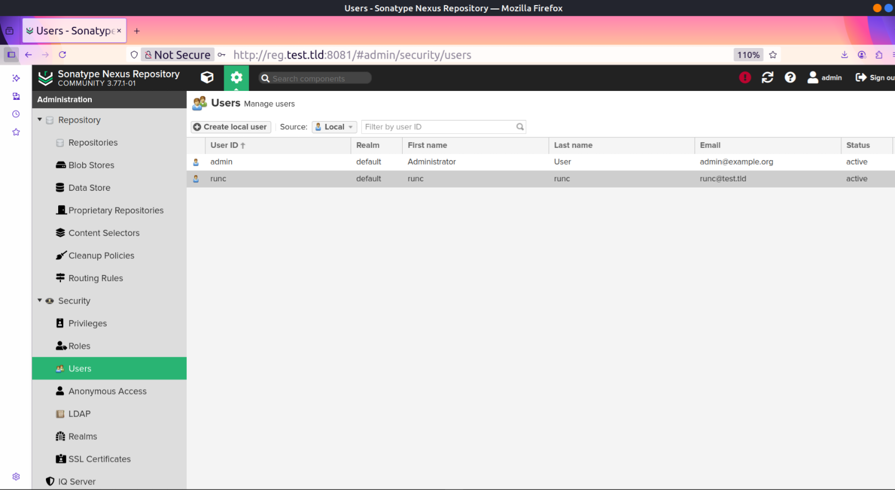
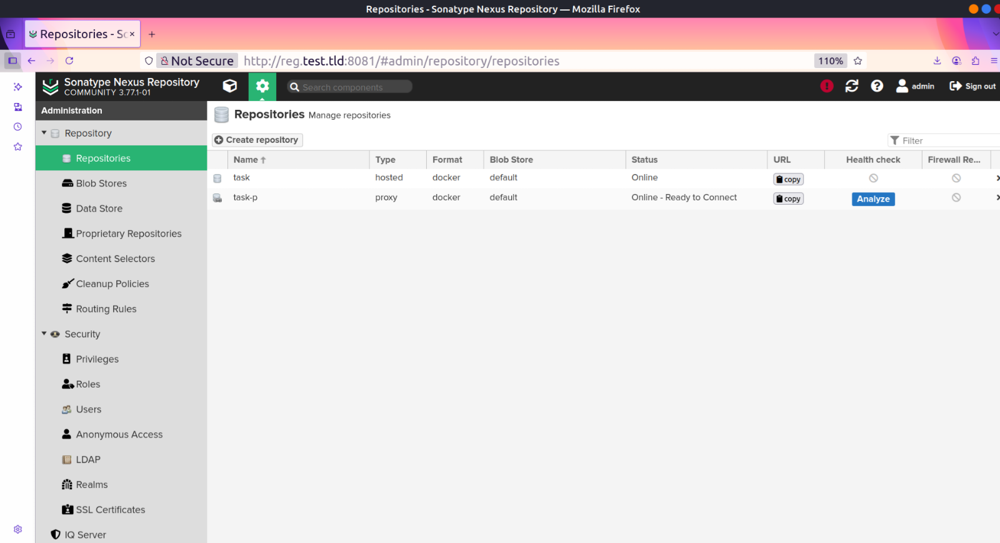
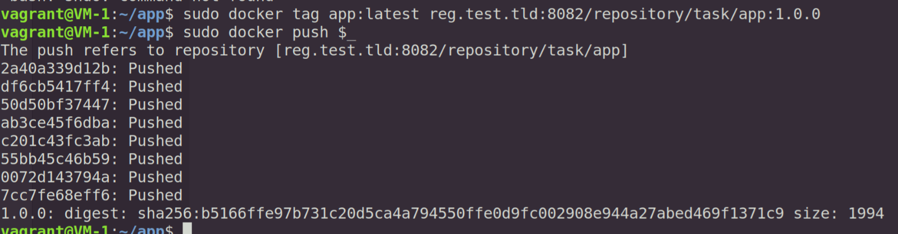
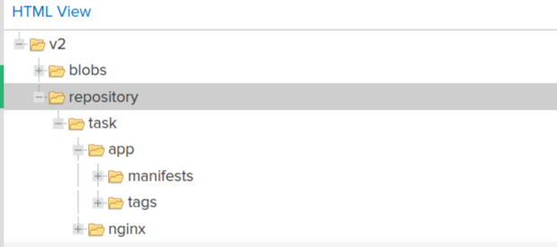

#registry readme
Usually we install and configure nexus with ansible and nexus apis and put the passwords in valt, but considering that we do these steps manually and do not use orchestration, the passwords are in the .env file and are not complex, which we change after installation.

#### To-do list:
- [x] create docker compose
- [x] run compose file
- [x] change root password
- [x] Disable anonymous user
- [x] Create runc user

- [x] Removing default repositories
- [x] Creating Docker repositories

- [x] Adding to servers as an insecure registry
- [x] push test


- [] pull test
- [] proxy test

#DNS :

After installing **dnsmasq**, I put the following in its configuration file:
```bash
no-resolvi
#I put local records in hosts file
#no-hosts
server=2.189.44.44
server=8.8.8.8
server=4.2.2.4
server=/docker.com/178.22.122.100
server=/docker.com/185.51.200.2
listen-address=192.168.122.173,127.0.0.1
cache-size=1000
log-queries
log-facility=/var/log/dnsmasq.log
```

